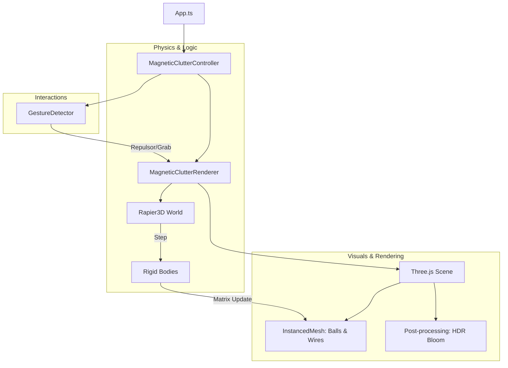

# Magnetic Clutter Mode - Design Document

## 1. Vision & User Experience

### Goal

The Magnetic Clutter mode is designed as a high-fidelity, tactile "digital toy" that explores the interplay between physics-based attraction and energetic repulsion. It aims to create a "satisfyingly chaotic" experience where dozens of magnetic balls form a dense, organic cluster that reacts dynamically to the user's presence and gestures.

### Credits & Inspiration

This mode is inspired by and based on the creative work of **[Gioda](https://x.com/gioda123456)**.

- **Original Code**: [Magnetic Balls CodePen](https://codepen.io/Gioda34/pen/QwErpzQ)
- **Author**: [@gioda123456](https://x.com/gioda123456)

### User Experience Flow

1.  **Entry**: A swarm of metallic, white-glowing balls floats in a dark void, naturally coalescing toward the center of the scene.
2.  **Interaction**:
    - **Right Hand (Fist)**: Activating a fist gesture spawns a bright, emissive "Repulsor Sphere". Moving this sphere into the cluster "kicks" the balls away with high velocity, scattering them into the void.
    - **Left Hand (Pinch)**: Performing a pinch gesture allows the user to "grab" the nearest ball. The grabbed ball follows the hand with high physical responsiveness, pulling other nearby balls with it due to their mutual attraction.
3.  **The "Satisfying" Loop**: The core loop is the cycle of **Order (Cluttering)** -> **Chaos (Repulsion/Kicking)** -> **Order (Re-forming)**. The balls are under constant "central gravity," ensuring they always return to form a cluster after being disturbed.

---

## 2. Technical Architecture

### 2.1 System Overview

The mode is orchestrated by the `MagneticClutterController`, which bridges hand tracking data with a high-performance physics-rendering pipeline. It utilizes **Rapier3D** for deterministic physics and **Three.js** with **Instanced Rendering** for visual efficiency.

### 2.2 Core Technologies

- **Rapier3D**: A Rust-based physics engine (via WebAssembly) used for all rigid body dynamics, including collisions and force applications.
- **Three.js**: Used for rendering, leveraging `InstancedMesh` to draw hundreds of complex geometries in a single call.
- **Postprocessing**: A library for implementing high-quality, cinematic Bloom and HDR effects.

---

## 3. Physics Simulation: The "Magnetic" Feel

The "magnetic" behavior is not achieved via traditional magnetic fields, but through a combination of **Central Attraction Forces** and **Rigid Body Collisions**.

### 3.1 Central Gravity (The "Magnet")

Every ball in the scene is a dynamic rigid body. In every frame, a custom force is applied to each ball:

- **Vector**: Direction from the ball toward the scene center `(0, 0, 0)`.
- **Magnitude**: A constant pull strength (`-0.5`).
- **Result**: This creates a "gravity well" at the origin, causing the balls to naturally "clutter" together into a sphere-like mass.

### 3.2 Inter-Ball Interaction

- **Colliders**: Each ball has a `RAPIER.ColliderDesc.ball(size)` associated with it.
- **Natural Sticking**: Because the balls are constantly being pulled toward the center, they collide and rest against each other. The Rapier solver handles the "stacking" and "sliding" behavior that makes the cluster feel like a solid yet fluid mass.
- **Damping**: Linear and angular damping are set to `0.5` to ensure stability and prevent the balls from spinning or oscillating forever.

---

## 4. Lighting & Visual Design

### 4.1 Ball Construction

Each "magnetic ball" is actually two layers rendered via instancing:

1.  **Inner Core**: A white, flat-shaded `IcosahedronGeometry`. Flat shading is used to emphasize the geometric, "digital" nature of the particles.
2.  **Outer Wireframe**: A slightly larger (`1.01x`) wireframe mesh with a deep red color (`0x990000`). This adds a layer of technical detail and visual depth.

### 4.2 The "Infinite Glow" (HDR Bloom)

The "glowing" effect is achieved through a high-dynamic-range (HDR) bloom pipeline:

- **Tone Mapping**: The renderer uses `HalfFloatType` frame buffers to preserve color values exceeding `1.0`.
- **Threshold**: The `BloomEffect` is tuned with a very low threshold (`0.005`), ensuring that even relatively dim highlights contribute to the soft, ethereal glow.
- **Intensity**: Set to `2.0` by default, giving the balls a "luminous" appearance that bleeds into the surrounding void.

---

## 5. Interaction Mechanics

### 5.1 The Repulsor Sphere (Right Fist)

When a "Right Fist" is detected, the `MagneticClutterRenderer` spawns a **Kinematic Repulsor Body**:

- **Technique**: Position-based Kinematic. It is not moved by forces; it is "teleported" to match the hand's 3D position.
- **Physics Influence**: It has a large collider (`3.0x` the sphere's visual size). When it sweeps through the cluster, it physically pushes (kicks) the balls away.
- **Energy Transfer**: Because the repulsor is kinematic and moves based on the user's hand velocity, it imparts massive momentum to the dynamic balls, resulting in energetic scatters.

### 5.2 The Grabber (Left Pinch)

When a "Left Pinch" is detected:

- **Selection**: The controller finds the nearest ball handle to the pinch center.
- **Response**: The grabbed ball's velocity is directly manipulated (`setLinvel`) to match the hand's motion.
- **Chained Reaction**: Because the grabbed ball still has its collider and is subject to the central gravity pulls of other balls (indirectly through collisions), moving one ball often subtly disrupts the entire cluster.

---

## 6. Performance & Optimization

To maintain a steady **60+ FPS** even with high ball counts, several optimizations are implemented:

- **Instanced Rendering**: All 100+ balls are drawn in two draw calls (one for cores, one for wires) rather than 200+.
- **Pre-allocation (GC Zero)**: Mathematical objects (`Vector3`, `Matrix4`, `Quaternion`) are instantiated once and reused in every frame to prevent Garbage Collection spikes.
- **Throttled Detection**: Hand tracking landmarks are processed at **~33ms (30 FPS)** while the physics and rendering run at the full monitor refresh rate. This balances CPU load between AI vision and physics simulation.

---

## 7. Configuration & Constants

| Constant        | Default Value | Description                                   |
| :-------------- | :------------ | :-------------------------------------------- |
| `ballCount`     | `100`         | Number of individual magnetic entities.       |
| `centralPull`   | `-0.5`        | Magnitude of the force toward `(0,0,0)`.      |
| `repulsorForce` | `20.0`        | Force multiplier for the kicking interaction. |
| `bloomStrength` | `2.0`         | Intensity of the emissive glow.               |
| `linearDamping` | `0.5`         | Physics "friction" to stabilize the cluster.  |
