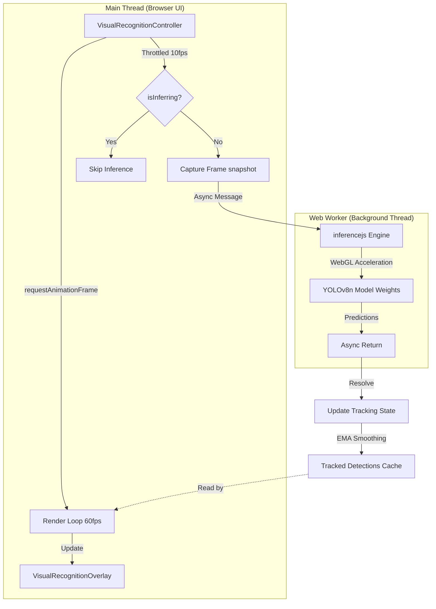
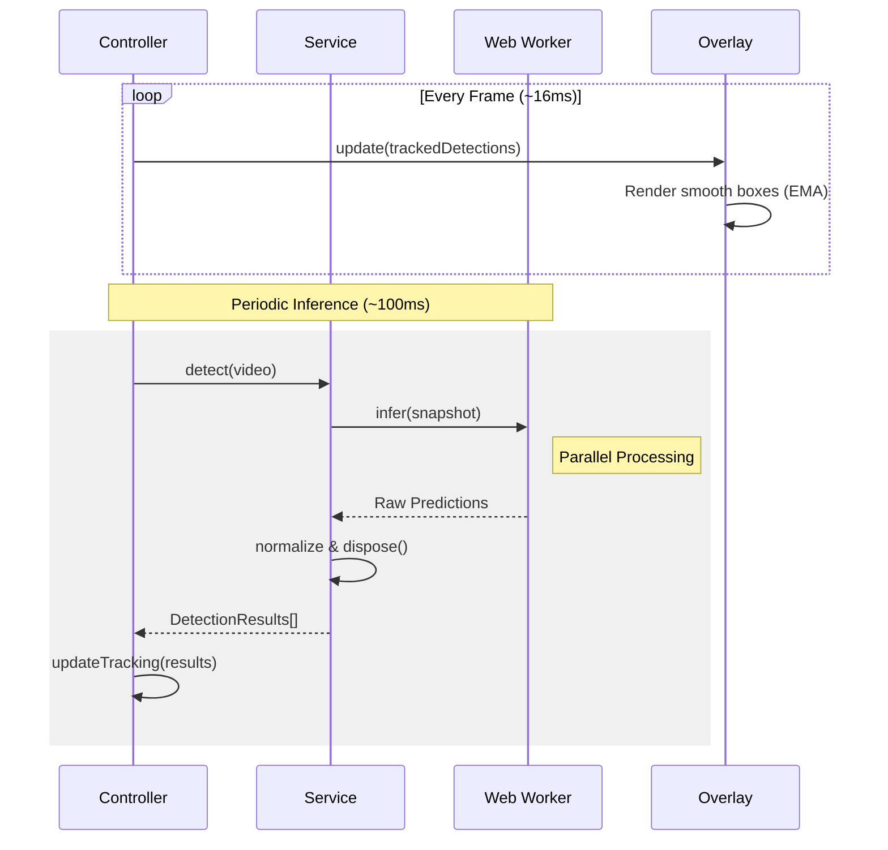

# Visual Recognition: Design and Technical Architecture

This document serves as the official documentation and technical white paper for the **Visual Recognition** mode in Gesture Lab. It provides a definitive source of truth for the mode's architecture and logic. The documentation is designed to be accessible to all readers, regardless of prior experience with Artificial Intelligence (AI) or Computer Vision. It details the purpose of the feature, the rationale behind its design decisions, and its underlying mechanics.

---

## 1. What is Visual Recognition?

**Visual Recognition** is a real-time object detection experiment that runs entirely inside a web browser. When activated, the device's webcam initializes, and the application instantly draws distinct bounding boxes around recognized common objects—such as people, cell phones, cups, or laptops. Alongside the bounding box, a label is displayed identifying the object and a percentage indicating the AI's confidence level (e.g., "person 92%").

The primary architectural advantage of Visual Recognition is that **no images are ever sent to a remote server.** All processing happens securely on the local device, utilizing the computational power of the device's graphics hardware.

---

## 2. Core Concepts Explained

Before analyzing the codebase, it is necessary to establish the fundamental concepts that make this pipeline possible.

### What is "Computer Vision"?

Computer Vision is a discipline of AI that trains computers to interpret and understand the visual world. Instead of processing an image merely as an array of colored pixels, Computer Vision algorithms are trained to recognize patterns, shapes, and specific objects within that array.

### Defining "Training" vs. "Inference"

There are two primary phases in AI classification workflows:

- **Training (The Studying Phase):** This involves feeding an algorithm millions of labeled images. In this phase, the AI learns to associate specific pixel patterns with human-defined labels (e.g., teaching an algorithm what a "dog" looks like by showing it thousands of dog photos). This process requires massive computational resources and results in a generalized file called a **Model**—the mathematical representation of the learned patterns. _This step is performed prior to runtime by external researchers._
- **Inference (The Verification Phase):** This occurs when a new, unseen image is presented to the trained Model. The Model uses its learned mathematical patterns to predict what object is present in the new image. This is called **Inference**. _This is the process occurring multiple times a second inside the browser during the Visual Recognition mode._

### The Model: COCO and YOLOv8n

- **COCO (Common Objects in Context):** The application utilizes a model trained on the Microsoft COCO dataset. COCO is the industry-standard benchmark for object detection. It is trained to recognize exactly **80 specific object classes** (such as person, car, dog, bottle, cell phone). If an object is not within these 80 classes, the model will either fail to detect it or misclassify it as the closest matching class. A complete explorer of these categories is available on the [official COCO website](https://cocodataset.org/#explore).
- **YOLOv8n (You Only Look Once - Version 8 Nano):** This defines the specific neural network architecture used. Legacy object detection systems scanned images incrementally. The YOLO architecture analyzes the _entire image at once_ on a localized grid, predicting all objects simultaneously. This methodology allows for real-time processing speeds. The "n" suffix denotes "nano," meaning the model weights are heavily compressed for deployment on high-latency or low-power environments like web browsers.

### Web Workers and Thread Isolation

Web browsers operate on a single main thread, which handles user interactions, DOM updates, and 60-frames-per-second (FPS) rendering. Matrix multiplication required for AI inference is highly computationally expensive. If this math were executed on the main thread, the browser UI would freeze completely during the calculation.

To resolve this, the architecture utilizes a **Web Worker**. A Web Worker operates as an isolated background thread. The heavy AI calculations are offloaded to this background thread, which processes the data and asynchronously passes the results back to the main thread. This separation ensures the visual rendering loop remains uninterrupted.

---

## 3. The Technology Stack

4.  **HTML5 Canvas:** A transparent DOM element utilized as a drawing layer, positioned precisely over the video feed to render the bounding boxes and text labels.

### High-Level Architecture



---

## 4. The Request Lifecycle

When the "Visual Recognition" mode is selected, the system executes the following deterministic lifecycle:

### Step 1: Controller Initialization (`VisualRecognitionController.ts`)

The `VisualRecognitionController` acts as the orchestrator. Its primary responsibility is managing the lifecycle of the subordinate services. It requests camera permissions via the browser API. Upon approval, the media stream is attached to a hidden `<video>` element in the DOM.

### Step 2: Viewport Mirroring

By default, webcams emit an unmirrored stream. However, users expect a mirrored view when looking at themselves on a screen. To provide natural interaction semantics, a CSS transform (`transform: scaleX(-1)`) is applied to the video element, flipping the visual output horizontally.

### Step 3: Model Hydration (`VisualRecognitionService.ts`)

The Controller signals the `VisualRecognitionService` to initialize.

1.  The service instantiates an `InferenceEngine` via `inferencejs`.
2.  The engine is configured to retrieve the official `coco` model, version `3`.
3.  The engine spawns a background **Web Worker**, downloads the compressed model weights (~10MB), loads them into GPU memory via WebGL, and resolves the initialization Promise.

### Step 4: The Non-Blocking Inference Loop

A rendering loop synced to the monitor's refresh rate (typically 60 FPS) is initiated via `requestAnimationFrame`. To ensure maximum performance and UI responsiveness, the rendering and inference logic are decoupled.



- **Rendering State (60 FPS):** The interface continuously draws the latest "Tracked Detections" (see Step 7). This ensures the UI remains fluid and responsive to user movement even during complex AI calculations.
- **Inference State (Throttled ~10 FPS):** Every 100 milliseconds, the Controller checks if a detection cycle is already in progress. If the engine is idle, it dispatches a frame for analysis.
- **Fire-and-Forget Logic:** Crucially, the main rendering loop **does not wait** for the AI to finish its calculation. Instead, it "fires" the request and immediately continues rendering the previous results. When the AI eventually returns new data, the track history is updated asynchronously. This eliminates the "micro-stutters" or UI hangs that would occur if the threads were synchronized.

### Step 5: Coordinate Normalization

Within the background thread, the YOLOv8n model processes the snapshot and returns a JSON payload containing the detected classes, confidence scores, and bounding box coordinates.

```json
{
  "class": "person",
  "confidence": 0.92,
  "bbox": { "x": 640, "y": 360, "width": 400, "height": 800 }
}
```

**The Normalization Requirement:**
Roboflow's API models bounding box coordinates originating from the _center_ of the detected object. Conversely, HTML Canvas rendering APIs expect origin coordinates starting from the _top-left_ corner.

The `normalizePrediction` method intercepts the raw AI payload and applies the necessary translation matrix:
`TopLeftX = CenterX - (Width / 2)`
`TopLeftY = CenterY - (Height / 2)`

### Step 6: Rendering and Scaling (`VisualRecognitionOverlay.ts`)

The normalized bounding box data is transmitted to the `VisualRecognitionOverlay`. This class manages an HTML `<canvas>` element layered precisely over the video feed.

1.  **Retina/HiDPI Support:** Local coordinate systems differ from physical pixel grids on modern high-density displays (e.g., Apple Retina). The overlay detects the `devicePixelRatio` and scales the canvas's internal buffer accordingly. This ensures bounding boxes are razor-sharp and prevents pixel-alignment "blur" or coordinate drift.
2.  **Viewport Scaling:** The AI analyzes the raw video stream resolution (e.g., 1280x720). The user's browser viewport generally scales this video element to fit the screen. The overlay calculates the viewport-to-source ratio and scales the AI's coordinates to guarantee accurate box placement regardless of CSS resizing.
3.  **Deterministic Coloring:** To ensure visual consistency, the `getClassColors` function applies a string-hashing algorithm to the detected class name. This ensures that a "person" always evaluates to the same hue across every frame.
4.  **Low-Confidence Visualization:** To provide transparency regarding the AI's "certainty," detections with a confidence score below **40%** are rendered with a **dashed border** rather than a solid one. This subtly informs the user that the detection is a best-guess rather than a high-certainty match.
5.  **The Counter-Scale Text Fix:** Because the video element is horizontally mirrored via CSS, text labels would appear backwards. The `drawLabel` method implements localized transform inversion (`ctx.scale(-1, 1)`) to flip the text horizontally back to a readable state while maintaining its spatial anchor.

### Step 7: Temporal Smoothing and Tracking

Raw AI output can be "noisy," with bounding boxes flickering or disappearing for a single frame if a shadow or movement confuses the model. To resolve this, the Controller implements a temporal tracking system:

1.  **IoU Matching (Intersection over Union):** New detections are mathematically compared against detections from the previous frame. If a new box overlaps significantly with an old box of the same class, they are "linked" as the same object.
2.  **EMA Coordinate Smoothing:** Instead of instantly moving a box to a new position, the system uses **Exponential Moving Average (EMA)**. New coordinates are blended with the old ones (e.g., 50% old, 50% new). This results in smooth, fluid box movement that feels organic rather than robotic.
3.  **Persistence (Ageing):** If an object is momentarily missed by the AI for 1 or 2 frames (approx. 200ms), the system "remembers" it and continues to draw it at its last known position. The box is only removed if it remains undetected for more than 3 consecutive inference cycles, effectively "filling in the gaps" of the AI's vision.

The loop then repeats for the duration of the session.

---

## 5. Key Architecture Principles

The implementation adheres to strict structural standards:

- **Dependency Inversion Principle (SOLID):** The broader application architecture isolates all knowledge of `inferencejs` to within `VisualRecognitionService.ts`. The rest of the application interacts exclusively with a sanitized `DetectionResult` TypeScript interface. This prevents vendor lock-in and allows the underlying AI execution engine to be swapped without requiring structural refactoring.
- **Separation of Concerns:**
  - `VisualRecognitionController` handles high-level orchestration scheduling.
  - `VisualRecognitionService` handles I/O and data normalization with external APIs.
  - `VisualRecognitionOverlay` handles pure visual state rendering.
- **Zero Leakage (GPU Optimization):** Every inference cycle creates specialized GPU objects (`CVImage`). The `VisualRecognitionService` implements a strict initialization-to-disposal lifecycle, ensuring that all GPU tensors are explicitly freed (via `.dispose()`) after every frame. This prevents GPU memory exhaustion and ensures the application remains performant even after hours of continuous use. When deactivated, the Controller forcefully terminates the Web Worker thread and clears all caches.
- **Safety and Reliability:**
  - **Fail-Safe Thresholds:** The model is locked to a **25% confidence threshold**. If the AI is less than 25% sure an object exists, it is suppressed to prevent "ghost" detections.
  - **Format Resilience:** The upstream inference library's JSON schema can be unstable. The domain layer defends against this by verifying data structures prior to normalization, preventing fatal `NaN` (Not a Number) cascade failures in the math computations.

---

## Summary

The Visual Recognition mode demonstrates the application of modern browser capabilities. By isolating computationally expensive WebGL matrix operations inside dedicated Web Worker environments, and pairing them with high-efficiency Canvas rendering paths, the architecture delivers a robust, privacy-first computer vision pipeline entirely on the client edge.
